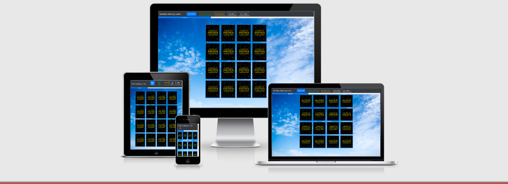

# MilestoneProject2 - Ruben Lopez

# StarWars Memory Game

## Table of contents
1. [Introduction](#Introduction)
2. [UX](#UX)
    1. [Game Objective](#Game-Objective)
    2. [User Objective](#User-Objective)
    3. [Project Goals](#Project-Goals)
    4. [User Stories](#User-Stories)
    4. [Design](#Design)
3. [Changes I made throuought the project](#Changes-I-made-throuought-the-project)
3. [Features](#Features)
    1. [Design Features](#Design-Features) 
    2. [Existing Features](#Existing-Features)
    3. [Features to Implement in the future](#Features-to-Implement-in-the-future)
    4. [Skeleleton](#Skeleleton)
4. [Issues and Bugs](#Issues-and-Bugs)
5. [Technologies Used](#Technologies-Used)
     1. [Languages Used](#Languages-Used)
     2. [Frameworks, Libraries & Programs Used](#Frameworks,-Libraries-&-Programs-Used)
6. [Testing](#Testing)
     1. [Testing.md](TESTING.md)
7. [Deployment](#Deployment)
     1. [Forking the Repository](#Forking-the-Repository)
     2. [Deploying on GitHub Pages](#Deploying-on-GitHub-Pages)
     3. [Creating a Clone](#Creating-a-Clone)
8. [Credits](#Credits)
     1. [Content](#Content)
     2. [Media](#Media)
     3. [Code](#Code)
9. [Acknowledgements](#Acknowledgements)
***

## Introduction

- Starwars Memory Game is a game to speed up memory, and is for any person, of any age, to have fun.
- It has a relax presentation, without too many ornaments, focused on user action.
- The game is presented in a simple and direct way, so that the user can start playing without wasting time on other things. 
- In addition to the game there are secondary options, such as changing the background of the screen or activating the sound to make the game more enjoyable.

[Back to top ⇧](#StarWars-Memory-Game)

**Project Contains:**

User centric Website with HTML, CSS, JavaScript, Bootstrap, Sweetalert (JS library).

Live version : [View the live project here](https://rlopezba1.github.io/MilestoneProject2/)

## UX Strategy

- Game Objective

    - This game is for anyone who wants to entertain himself and have a good time. In particular, Star Wars lovers will enjoy 
        this game as it will remind them the saga they love so much.

    - The game is presented without too many preambles, directly to start playing. 
    The first thing every user sees are the cards with the image of Star Wars, as is the theme of the game.

    - Most people know how to play this game, but just in case, in the upper left corner, it is specified that it is a star wars memory game.

    - On its left side, we find the first button, which when clicked, explains the way to play and the objective of the game, which can help those who do not know how to play.

    - The next button allows us to change the background of the game to go deeper into the galactic atmosphere, or to return to the traditional blue sky background.

    - The next button allows us to start the game again.

    - The next two buttons allow us to activate and deactivate the music, which allows us to create a greater atmosphere of Star Wars.

- User Objective

    - Play a game that is fun, dynamic, entertaining, for all types of users, that is not difficult to play or understand.

    - Allows me to change and the interact(background, music, ...).

    - It has to be exciting, and we getting this with the time bar telling us the time left.

- Project goals
    - Create a fun, dynamic and entertaining game for the user
    - Create a relaxed image, quickly access the game and be able to interact easily.

- User stories

    1. As a site visitor, I want to start playing as soon as possible.
    2. As a site visitor, I want to learn how to play.
    3. As a site visitor, I want to see how long I have left to finish
    4. As a site visitor, I want to put music and change the background

- Design

    - Colors:
        - A palette of three colors to try to give an elegant and relaxed image, where each color complements each other.
        - Color palette - Three main colors complement the design of the site. These are shown below: 
        - #1c7ccc It's the background color for the cards
        - #007bff It's info button color
        - #28a745 It's dark/light button color
        - #ffc107 It's the restart button color
        - #f8f9fa It's the music button color  

    - Typography:
    
[Back to top ⇧](#StarWars-Memory-Game)

## Changes I made throuought the project

- Initially, I wanted the information to appear right next to the game but I realized that in smaller devices, the cards were very small.
- So I opted to place all the options in a navigation bar so that small devices can play perfectly as the navigation bar collapses, and it is up to the user to see them or not.
    
## Features

- I want the website to be original, fun, easy to use.
  
- The webpage has a simple structure to facilitate its function. At the top is a fixed response navigation bar with buttons that will give the user different options to modify the image and to know the operation of the game, as well as to start the game again.

- The user experience should be easy to navigate and have a good time.

- The web will be elegant and fun at the same time. The navigation bar will collapse on mobile devices and be justified centrally on the page.

- Research has been carried out on other Internet pages, but this design, with these colors, images, structure, and fonts,
   it is completely original.

## Skeleleton
- [Wireframe in Design](https://github.com/rlopezba1/MilestoneProject1/blob/main/NewProject1.pdf) 
   using Balsamiq in large, medium and small devices sizes.
   
- Responsive Design
    - I have changed the initial design, as I think it is important to give the maximum importance to the game, and therefore the cards should be as large as possible 
    on the smallest devices.
    - The information of the game, the change of theme, or the activation of the music are secondary, so on small devices, they are hidden and it is up to the user if they want to use them or not.

## Issues and Bugs
The text on the main page did not look good on some devices. 
- I had to change the margin and heights for these devices.
- I had some problems with combination of CSS and Bootstrap structure.
- I had some problems with the cards on the small size screen. I solved it by changing the margins and heights.

All of these problems have taken me a long time but I have enjoyed solving them.

[Back to top ⇧](#StarWars-Memory-Game)

## Technologies Used
### Languages Used
- HTML5
- CSS3
- JavaScript
### Frameworks, Libraries & Programs Used
1. [Bootstrap 4](https://getbootstrap.com/) was used to assist with the responsiveness and styling of the website.
2. [Google Fonts](https://fonts.google.com/) were used to import the 'Roboto' font into the style.css file
         which is used on all pages throughout the project.
3. [Font Awesome](https://fontawesome.com/) was used on all pages throughout the website to add icons for UX purposes.
4. [JQuery](https://jquery.com/) came with Bootstrap to make the navbar responsive but was also used for the smooth scroll function in JavaScript.
5. [Git](https://git-scm.com/) was used for version control by using the Gitpod terminal to commit to Git and Push to GitHub.
6. [GitHub](https://github.com/) is used to store the projects code after being pushed from Git.
7. [Microsoft Photo Editor](https://www.microsoft.com/en-us/windows/photo-movie-editor) was used to resizing images and editing photos for the website.
8. [Balsamiq](https://balsamiq.com/) was used to create the wireframes during the design process.

## Deployment
### Forking the Repository
The site was developed in GitPod and pushed to the following remote GitHub repository - [REPO](https://github.com/rlopezba1/MilestoneProject2)

The following GIT commands were used throughout deployment:

- git status ------ used to check the status of files and which have been modified.
- git add ------ to stage files before commit.
- git commit -m " " ------ to commit the files.
- git push ------ to push the files to the master branch of the GitHub repo.

### Deploying on GitHub Pages
This site is hosted using GitHub pages, deployed directly from the master branch. - [LIVE SITE](https://rlopezba1.github.io/MilestoneProject2/)

The following steps were taken to complete the hosting process.

- Log into GitHub.
- Choose the relevant repository [StarWars Memory Game](https://github.com/rlopezba1/MilestoneProject)
- Go to settings.
- Scroll down to GitHub Pages section.
- Select as a source master branch.
- The page will automatically refresh.

### Creating a Clone
To run this code locally, you can clone this repository directly into the
editor of your choice by following the steps below:

- Open Terminal.
- Change the current working directory to the location when you want the cloned directory.
- Type the following into your Terminal: git clone https://github.com/rlopezba1/MilestoneProject2
- Press Enter to create a local clone.
- To cut ties with this GitHub repository, type git remote rm origin into the terminal.

[Back to top ⇧](#StarWars-Memory-Game)

## Credits

### Content
- All content was written by the developer.
	

### Media

1. Light theme Photo by  Ellia Clerici from Pexels
2. Dark theme Photo by  Felix Mittermeller from Pexels 
3. StarWars photos from Pexels

### Code 
- The developer consulted multiple sites in order to better understand the code they were trying to implement. 
- The following sites were used on a more regular basis:
- [Stack Overflow](https://stackoverflow.com/ "Link to Stack Overflow page")
- [W3Schools](https://www.w3schools.com/ "Link to W3Schools page")
- [Bootstrap](https://getbootstrap.com/ "Link to BootStrap page")

#### Acknowledgements

- Sites Used

    1. [Pexels](https://www.pexels.com/) was used to choose the images used on the website.

    2. [Am I Responsive](http://ami.responsivedesign.is/) used for testing purposes and for the screenshot at the top of my README filed
     to display the webside on different devices.

    3. [Stack Overflow](https://stackoverflow.com/) used to solve coding doubts during the web creation process.

    4. [W3school](https://www.w3schools.com/) used to solve coding doubts during the web creation process.

    5. [Tutorialspoint](https://www.tutorialspoint.com/index.htm) used to solve coding doubts during the web creation process.

    6. [freeCodeCamp](https://freeCodeCamp.org/) used to help me with Memory game structure.

    7. [javascript-tutor.net](https://javascript-tutor.net/) used to help me with Memory game code.

    8. [javascriptinfo.com](https://javascriptinfo.com/) used to help me with Memory game code.

- I received advice and support from

    - I would like to thank my mentor, Seun, for her invaluable help and guidance throughout the process.
    

[Back to top ⇧](#StarWars-Memory-Game)