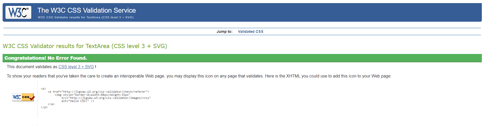
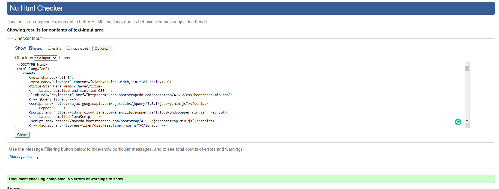

# Testing
- [Go back to the project and README file](https://github.com/rlopezba1/MilestoneProject2#User-Stories)
- [Go to the Star Wars Memory Game here!](https://rlopezba1.github.io/MilestoneProject2/)

## Content
1. [Automated Testing](#automated-testing)
2. [Manual Testing](#manual-testing)
3. [User Testing](#user-testing)

## Automated Testing

- [W3C CSS Validation](https://jigsaw.w3.org/css-validator/)
    - This project passed the W3C CSS Validator without any remarks. 26th February - 2021
    

- [W3C Markup Validation](https://validator.w3.org/)
    - This project passed the W3C Markup Validator without any remarks. 26th February - 2021
     

- [JSHint](https://jshint.com/)
    - This project was validated with JSHint validator on 26th February - 2021 with
        - 18 warnings because of using ES6 features
        - 2 Undefined variable
        - 4 Unused variables
- [Freeformatter](https://www.freeformatter.com/) to make the code more organized.

## Manual Testing 
- A large amount of testing was done to ensure that all pages were linking correctly.
- The navbar was tested to collapse at the correct breakpoint.
- The form and the modal were both tested for validation of inputted data and that the user is forwarded 
to the response page once submitted.
- All buttons and nav links were checked for correct forwarding address.

## Manual testing
All manual tests were done in the following browsers:
- Firefox
- Google Chrome
- Microsoft Edge

All of the above tests were done in the Google Chrome Device Toolbar on the following devices:

- iPad
- iPad Pro
- iPhone 5/SE
- iPhone 6/7/8
- Galaxy S5

- Responsiveness.
    - Check that the content fits into all viewports.
    - Check that on iPad, iPhone 5/SE, iPhone 6/7/8 and Galaxy S5 the sections are well presented
    - Make sure that no content gets squished or overlaps the main structure.
